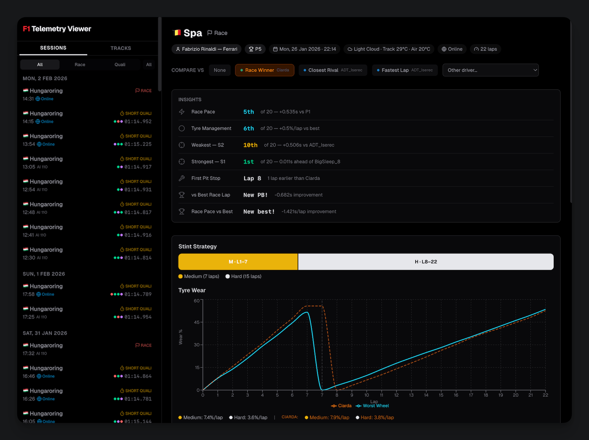

# F1 Telemetry Viewer

A web app for visualizing telemetry data exported by [Pits n' Giggles](https://github.com/ashwin-nat/pits-n-giggles), the F1 sim racing self-engineering tool. Reads the JSON session files that Pits n' Giggles auto-saves after each session and presents them as interactive charts and tables.

Works with telemetry from **F1 23**, **F1 24**, and **F1 25**.



Vibe-coded with AI by [Fabrizio Rinaldi](https://fabrizio.so), so expect some small bugs and issues.

> [!NOTE]
> This project is not affiliated with Pits n' Giggles — it just reads its custom JSON telemetry format. Check out [pitsngiggles.com](https://www.pitsngiggles.com/) for the tool itself.

## What you get

- **Dashboard** — Performance trends across all your sessions: lap times, consistency, tyre wear rates
- **Session detail** — Lap-by-lap breakdown for race and qualifying sessions. In races, pick any rival (or use smart presets like closest rival, race winner, fastest lap) and see a cumulative delta chart showing exactly where you gained or lost time. In qualifying, compare sector times across all your laps to find where you left time on the table
- **Track progress** — See how your pace on a specific track improves over time. Computes your theoretical best lap (best S1 + S2 + S3 from any session), tracks sector trends, and plots every qualifying lap across sessions so you can spot the progression

Every session includes the full grid — so whether you're racing AI or real people online, you can compare yourself against any driver on the grid.

## Loading your data

**Running locally?** Point the app at your telemetry folder via the `TELEMETRY_DIR` env variable and it reads the JSON files directly.

**Using a hosted version?** The app ships with sample telemetry data so you can explore all the features right away. When you're ready, drag and drop a `.zip` of your own telemetry folder — everything is processed in the browser, no upload to any server.

## Setup

```bash
pnpm install
```

Copy `.env.example` to `.env` and set the path to your Pits n' Giggles telemetry directory:

```
TELEMETRY_DIR=/path/to/your/telemetry/files
```

The app recursively scans this directory for `.json` files. Telemetry filenames follow the pattern `SessionType_Track_YYYY_MM_DD_HH_mm_ss.json` (e.g. `Race_Monza_2024_07_15_20_30_00.json`).

## Development

```bash
pnpm dev            # Start dev server at http://localhost:5173
pnpm dev:prod       # Dev server without local API (uses demo data, like production)
pnpm build          # Type-check + production build
pnpm preview        # Preview production build locally
pnpm generate-demo  # Regenerate trimmed demo data in public/demo/
```

## Stack

React 19, TypeScript, Vite 7, Tailwind CSS 4, Recharts 3, React Router 7

## Architecture

```
src/
  components/    Charts, data tables, layout, upload screen
  context/       TelemetryProvider (dual-mode data loading), zip loader
  hooks/         useSessionList, useSession, useTrackHistory
  pages/         Dashboard, Session detail, Track progress
  plugin/        Vite plugin that serves telemetry JSON as a local API
  utils/         Formatting, statistics, filename parsing, color mappings
  types/         TypeScript types for the telemetry data model
```

The `TelemetryProvider` context abstracts data access with a three-step detection chain: first it tries the local API (dev mode) → then bundled demo data (`public/demo/`) → then falls back to upload mode with a drop zone. All hooks and pages read from the context, so they work identically across all modes.
